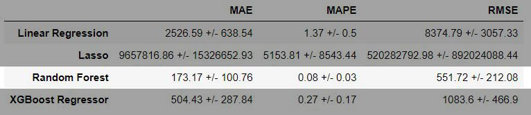

# 1.0 Business Problem
## 1.1 Data description
Seazone is a Proptech focused on the Short-Stay Vacation Homes market. This market is
composed by players such as Guests, Hosts, Real Estate Investors, Constructors and Home
Service Providers and we offer the following products and services:
- Property management
- Real Estate Project Development
- Online Travel Agency (reservation marketplace)
- Professional Hosting
As a data-driven company we need to have reliable data and analysis in order to make
strategic decisions. In order to do this we built an ETL pipeline based on two main data
sources: Airbnb and VivaReal. To feed the pipeline we designed a group of scrapers that
acquire the data available online from these websites daily and drop it inside of a data lake.
For this challenge we will provide 5 data sets to evaluate your skills in data wrangling,
enriching, modeling and also on machine learning.

## 1.2 Data analysis
Itapema is a strategic city for Seazone and we would like to know, based on the data,
if we should focus on it or not. In order to make our decision we would like you to tell us the
following:
- What is the best property profile to invest in the city?
- Which is the best location in the city in terms of revenue?
- What are the characteristics and reasons for the best revenues in the city?
- We would like to build a building of 50 apartments in the city, where should we build it
and how should the apartments be designed in order to be a great investment?
- How much will be the return on investment of this building in the years 2024, 2025
and 2026?

# 2.0 Solution Strategy
## 2.1 Inputs
* Business Questions
1. What is the best property profile to invest in the city?
2. Which is the best location in the city in terms of revenue?
3. What are the characteristics and reasons for the best revenues in the city?
4. We would like to build a building of 50 apartments in the city, where should we build it
and how should the apartments be designed in order to be a great investment?
5. How much will be the return on investment of this building in the years 2024, 2025
and 2026?
* datasets
1. Price_AV_Itapema.csv (43020080 rows and  14 colunas)
2. VivaReal_Itapema.csv (17547 rows and 42 columns)
3. Hosts_ids_Itapema.csv.csv (32558 rows and 37 columns)
5. Mesh_Ids_Data_Itapema.csv (2373 rows and 7 columns)
## 2.2 Outputs
1. A business profile of the best properties cluster, based on their revenue
2. The best localization based on their revenue
3. Designed characteristics of the best properties according to their revenue
4. Designed characteristics and localization according to their ROI
5. The prediction values of the referred years
## 2.3 Tasks
1. Identify better business metrics for clustering and train a model
2. Use the clustered model and point out the best neighborhoods
3. Use the clustered model and point out the best design features and localization
4. Use the clustered model and point out the best design features location and demand for hosting
5. Create a regression model to forecast demand
## 2.4 Cicles
1. Create a functional, end-to-end data pipeline (from data collection to model training)
2. Understand the data and clean it (search for inconsistencies) Statistical analyzes first order descriptive
3. Feature Engineering (create variables that model the phenomenon)
4. Exploratory data analysis
5. Define metrics and train the model
6. Analyze metrics
7. Business result analysis and conclusions
# 3.0 Business Assumptions
1. Samples with feature **evailable equal to False** will be considered how to be generating revenue
2. **Future dates** and their features will be considered as facts
# 4.0 Tools and Requirements
- Language: Python
- Development: Jupyter Notebook
- Delivery: Public Repository on Github
# 5.0 Top 3 Data Insights
# 6.0 Machine Learning Applied
## 6.1 Machine Learning Regressor
Random Forest Regressor
## 6.2 Machine Learning Clustering
KMeans
# 7.0 Machine Learning Performance

# 8.0 Business Results

## Business Question 1: What is the best property profile to invest in the city?
Localized at Varzea with 2 bedrooms. Properties with 3 bedrooms are 5% more profitable compared to 2 bedroom properties. On the other hand, they are more than 2 times more expensive. Properties located in Várzea are on average 30% more profitable compared to Meia Praia, and on average the market value for purchase is 3 times lower. Apartments are 20% more profitable than houses and 10% more expensive to buy.

## Business Question 2: Which is the best location in the city in terms of revenue?
Properties located in Estaleirinho are rented on average every 2 days, and generate R$ 6500,00 monthly revenue on average 

## Business Question 3: What are the characteristics and reasons for the best revenues in the city?
The most popular location is Meia Praia, the time factor matters, the months between October and January are the most profitable, apartments are 20% more profitable than houses, 2 or 3 bedrooms, 2 bathrooms.

## Business Question 4: We would like to build a building of 50 apartments in the city, where should we build it and how should the apartments be designed in order to be a great investment?
Properties with this configuration will be generate: R$120613.52 over the years 2024 and 2025
## Business Question 5: How much will be the return on investment of this building in the years 2024, 2025 and 2026?
# 9.0 Next Steps
•	Better understand the confiability of working with future events, as data from 2023 are contained in the dataset
•	Effect size studies and A/B testing on defined clusters, oriented towards financial metrics such as gross revenue
•	Deploy the model in a production environment via API with requests via Google Sheets
# 10.0 Project Status
